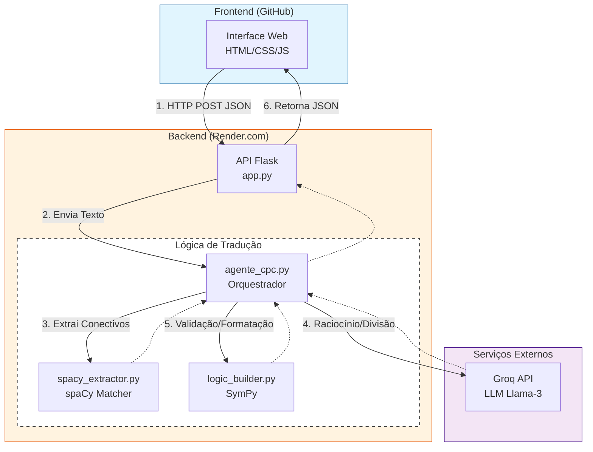

# 🤖 Trabalho NL-CPC: Tradutor de Linguagem Natural e Lógica Proposicional

Este projeto é um sistema que traduz sentenças da Linguagem Natural (Português) para o Cálculo Proposicional Clássico (CPC) e vice-versa, utilizando uma combinação de análise sintática baseada em regras e Inteligência Artificial Generativa (LLMs).

🔗 **Acesse a aplicação:** [https://jonta-h.github.io/Projeto_NL-CPC/frontend/](https://jonta-h.github.io/Projeto_NL-CPC/frontend/)

---

## 🏛️ Arquitetura do Sistema

### Desenho da Arquitetura

O sistema opera em um modelo cliente-servidor desacoplado:

1.  **Frontend:** Interface estática hospedada no GitHub.
2.  **Backend (API):** API Python/Flask hospedada no Render.com.
3.  **Lógica:** Módulos de processamento utilizando spaCy, SymPy e LLMs (Groq).

### Explicação de Funcionamento

O fluxo de dados segue a seguinte sequência:

1.  **Interface:** O usuário insere o texto e seleciona o modo (NL→CPC ou CPC→NL). O Frontend (HTML/JS) envia uma requisição POST para a API.
2.  **Controlador:** O Backend (Flask) recebe o pedido e aciona o `agente_cpc.py`.
3.  **Processamento:**
    * **spaCy:** Realiza a análise linguística de baixo nível (identificação de conectivos e negações).
    * **LLM (Groq/Llama-3):** Atua no raciocínio de alto nível, dividindo frases complexas ou gerando textos fluidos.
    * **SymPy:** Valida, constrói e formata as expressões matemáticas finais.
4.  **Retorno:** A fórmula ou frase traduzida é retornada em JSON e renderizada na tela pelo navegador.

---

## 🧠 Estratégia de Tradução

O sistema utiliza estratégias distintas para cada direção da tradução, visando maximizar a precisão lógica.

### 1. NL → CPC (Natural para Lógica)
Utilizamos uma abordagem de **Parser Recursivo Assistido por LLM**:

* **Regras e Mapeamento:** Utilizamos o `spaCy Matcher` para identificar conectivos lógicos exatos.
* **Precedência de Operadores:** Definimos manualmente a precedência para refletir a gramática natural, onde "ou" geralmente causa uma quebra anterior ao "e". A ordem de prioridade é:
    1.  Negação de Escopo (Maior prioridade)
    2.  Bi-implicação
    3.  Condicional
    4.  Disjunção
    5.  Conjunção
* **Divisão por LLM:** Quando um operador principal é identificado, a LLM divide a frase em suas partes constituintes (ex: condição e consequência).
* **Recursão:** O processo se repete até que restem apenas proposições atômicas (ex: "chove"), que são mapeadas para variáveis (P, Q).

### 2. CPC → NL (Lógica para Natural)
Utilizamos uma abordagem generativa com Few-Shot Prompting:

* **Normalização:** O input é limpo e padronizado.
* **Glossário Automático:** A LLM gera um glossário contextual para as variáveis (ex: P = "O sol brilha").
* **Geração Controlada:** O modelo recebe exemplos ("few-shot") para distinguir entre negações simples ("O gato não dorme") e negações de escopo ("Não é verdade que...").

---

## 📊 Exemplos e Análise

Abaixo estão exemplos de inputs processados pelo nosso agente, demonstrando acertos e o tratamento de erros.

### ✅ Casos de Sucesso

| Input (NL) | Output (CPC) | Análise |
| :--- | :--- | :--- |
| *"Se maria chora então esta triste"* | $(P \rightarrow Q)$ | **Acerto.** A extração identificou corretamente a relação de condição e consequência. |
| *"Se chove, não faz sol"* | $(P \rightarrow \neg Q)$ | **Acerto.** O sistema detectou a negação interna na consequência ("não faz sol"). |
| *"Ou faz frio, ou faz calor e está sol"* | $((P \lor Q) \land R)$ | **Acerto.** O sistema respeitou a regra de precedência onde a Disjunção foi processada antes da Conjunção no contexto da frase. |
| *Input CPC:* $\neg P$ | *"O sol não está brilhando"* | **Acerto (Gerativo).** O modelo gerou uma negação natural em vez de usar a forma formal "Não é verdade que". |

### ❌ Casos de Erro / Limitações

| Input | Output Gerado | Análise do Erro |
| :--- | :--- | :--- |
| *"Para fazer um omelete, é necessário quebrar ovos."* | $(P \rightarrow Q)$ | **Confusão de Modo.** O sistema não identifica condicionais disfarçadas. |
| *"Todo homem é mortal..."* | $(P)$ | **Limitação de Lógica.** O sistema falha em capturar o quantificador "Todo" ($\forall$), pois opera apenas com Lógica Proposicional. |

---

## 🚧 Limitações e Melhorias Futuras

### Limitações Atuais
1.  **Lógica Proposicional Apenas:** O sistema não suporta Lógica de Predicados (Quantificadores $\forall, \exists$), o que impede a tradução correta de argumentos clássicos.
2.  **Dependência da LLM:** A precisão da extração em frases complexas depende da interpretação do modelo de IA (Llama-3), que pode errar em estruturas muito ambíguas.
3.  **Ambiguidade:** O sistema não resolve co-referências (ex: saber que "Ela" se refere a "Maria" na frase anterior).

### Possibilidades de Melhoria
* **Suporte à Lógica de Predicados:** Expandir o parser para usar *Dependency Parsing* e identificar Sujeito/Verbo/Objeto, permitindo traduções como $H(x) \rightarrow M(x)$.
* **Treinamento:** Treinar um modelo menor (como T5 ou BERT) especificamente para a tarefa de divisão de sentenças lógicas, reduzindo a dependência de LLMs grandes.
* **Gestão de Contexto:** Implementar uma memória de glossário para manter a consistência das variáveis em traduções sequenciais.

---

## 🎥 Demonstração do Agente

Confira o vídeo abaixo demonstrando o uso da ferramenta, desde a tradução de frases simples até a geração de texto a partir de fórmulas:

[**🔗 CLIQUE AQUI PARA ASSISTIR AO VÍDEO**](https://www.youtube.com/watch?v=4osZW5bQDHA)

---

## 👥 Equipe

* **Isadora Requer Kairala** - [GitHub]( https://github.com/Isadora-Kairala )
* **Jonata Henrique da Silva Cará** - [GitHub]( https://github.com/Jonta-H)
* **Laura Costa Nunes** - [GitHub]( https://github.com/lauracostanunes )
* **Laura Mendonça Arantes** - [GitHub]( https://github.com/Lalamarantes)
* **Marina Andrade Neves** - [GitHub]( https://github.com/marinanevesa)
* **Miguel de Moura Oliveira** - [GitHub]( https://github.com/migdmo )
